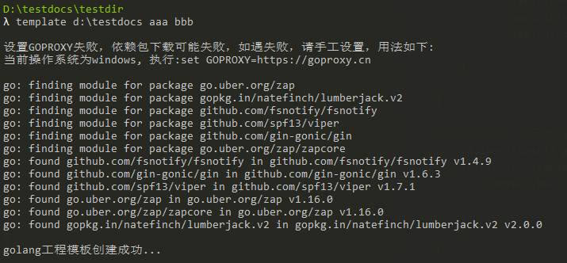

## DevOps Go Template

### 一、功能定义
Go工程模板  

### 二、 使用方式 
1、下载template.exe（Windows系统可用），或者template（Mac系统可用）  
2、执行命令：  
>template 项目路径 项目名称 应用名称

即可在指定的项目路径下，按照指定的项目名称创建golang工程模板  

示例：  

### 三、编译说明  
也可直接复制源码，进行二次修改，修改之后重新编译      
Window系统中编译Linux可用的二进制文件，在Windows的cmd中执行如下命令：  
>SET CGO_ENABLED=0  
SET GOOS=linux  
SET GOARCH=amd64  
go build main.go   

Windows系统中编译Mac可用的二进制文件，在Windows的cmd中执行如下命令：  
>SET CGO_ENABLED=0  
SET GOOS=darwin  
SET GOARCH=amd64  
go build main.go   

